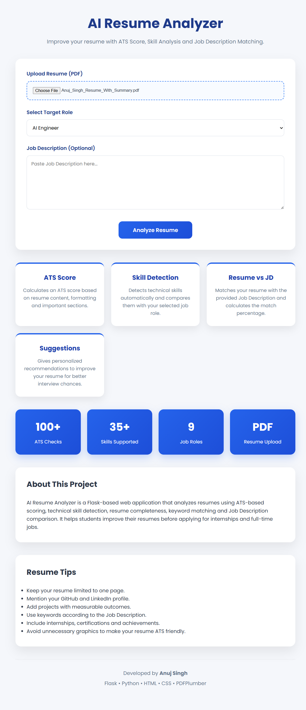
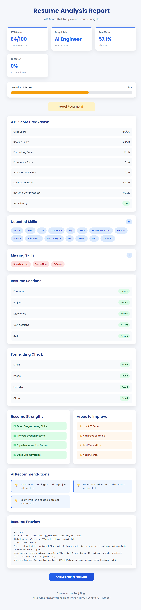

# AI Powered Resume Analyzer

A Flask-based web application that analyzes PDF resumes, calculates ATS scores, detects technical skills, compares resumes with Job Descriptions, and provides personalized recommendations.

---

## Features

- Upload Resume (PDF)
- ATS Score Calculation
- Resume vs Job Description Matching
- Technical Skill Detection
- Missing Skills Analysis
- Resume Completeness Check
- Resume Formatting Analysis
- ATS Friendly Resume Detection
- Achievement Detection
- Personalized Recommendations
- Responsive User Interface

---

## Tech Stack

- Python
- Flask
- HTML5
- CSS3
- PDFPlumber
- Regex
- Git
- GitHub
- Render

---

## Live Demo

https://ai-powered-resume-analyzer-8ah7.onrender.com

---

## Future Scope

- Resume Builder
- AI Resume Suggestions
- Resume PDF Download
- User Login
- More Job Roles
---

## Screenshots

### Home Page

### Resume Analysis Dashboard

---

## Author

**Anuj Singh**

GitHub: https://github.com/Anujs-hub